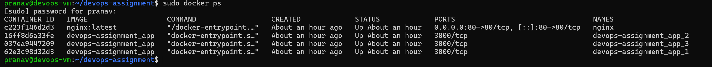

# DevOps Assignment – Node.js + Docker + Nginx

## Project Overview

This project demonstrates a simple DevOps workflow where a Node.js application is containerized using Docker and served through Nginx as a reverse proxy.

The application returns the message:

**"DevOps Assignment Working"**

when accessed from the browser.

The entire setup was implemented inside an Ubuntu Virtual Machine.

---

# Technologies Used

* Ubuntu Server 24.04 (Virtual Machine)
* VirtualBox
* Node.js (Express)
* Docker
* Nginx
* Git
* GitHub

---

# Virtual Machine Setup

The assignment required the environment to be created inside a VirtualBox VM.

A VM was created using **Ubuntu Server 24.04**.

While the VirtualBox terminal works, the screen size was small and difficult to read.
To simulate a real server environment and improve usability, **SSH access was configured** using VirtualBox port forwarding.

The VM was then accessed from the host terminal using:

```
ssh pranav@localhost -p 2222
```

This reflects real DevOps practices where servers are usually managed remotely using SSH instead of a graphical interface.

---

# Project Structure

```
devops-assignment
│
├── Dockerfile
├── README.md
├── screenshots
│
└── app
    ├── server.js
    ├── package.json
    └── package-lock.json
```

---

# Node.js Application

A simple Express application was created.

File: `app/server.js`

The application listens on **port 3000** and returns the message:

```
DevOps Assignment Working
```

when the root route `/` is accessed.

---

# Docker Containerization

A Dockerfile was written to package the application with its dependencies.

Main steps performed by Docker:

1. Use an official Node.js base image
2. Copy the application files
3. Install dependencies
4. Run the Node.js server

Docker image was built using:

```
docker build -t devops-assignment .
```

The container was started using:

```
docker run -d -p 3000:3000 devops-assignment
```

This command maps:

```
VM port 3000 → container port 3000
```

So the application becomes accessible at:

```
http://VM-IP:3000
```

---

# Nginx Reverse Proxy Configuration

Nginx was installed on the VM and configured as a reverse proxy.

Configuration file edited:

```
/etc/nginx/sites-available/default
```

The following block was added:

```
location / {
    proxy_pass http://localhost:3000;
}
```

This means that any request received on **port 80** will be forwarded to **port 3000** where the Docker container is running.

After editing the configuration, Nginx was restarted:

```
sudo systemctl restart nginx
```

Now the application can be accessed simply using:

```
http://VM-IP
```

without specifying port 3000.

---

# VM IP Address

VM IP obtained using:

```
ip a
```

VM IP:

```
10.0.2.15
```

Application endpoints:

Direct Docker access:

```
http://10.0.2.15:3000
```

Through Nginx reverse proxy:

```
http://10.0.2.15
```

---

# How the Request Flows (Practical Explanation)

This section explains what actually happens when a user opens the application in a browser.

### Step 1 — Browser sends request

When a user enters:

```
http://10.0.2.15
```

the browser sends an HTTP request to the VM on **port 80**.

Port 80 is the default HTTP port.

---

### Step 2 — Nginx receives the request

Nginx is running on the VM and listening on **port 80**.

So the request first reaches **Nginx**, not the Node.js application.

Nginx checks its configuration file and finds this rule:

```
proxy_pass http://localhost:3000;
```

This tells Nginx:

"Forward this request to another service running on port 3000."

---

### Step 3 — Request forwarded to Docker container

The request is forwarded to:

```
localhost:3000
```

Earlier, when running the Docker container, this mapping was created:

```
VM:3000 → Docker Container:3000
```

This means any request reaching **port 3000 on the VM** is sent to the container.

---

### Step 4 — Node.js application processes request

Inside the Docker container, the **Node.js Express application** is running.

The application receives the request at route:

```
/
```

and returns the response:

```
DevOps Assignment Working
```

---

### Step 5 — Response travels back to the browser

The response goes back through the same path:

```
Node.js App
   ↓
Docker Container
   ↓
Nginx Reverse Proxy
   ↓
Browser
```

The browser then displays:

```
DevOps Assignment Working
```

---

# Architecture Diagram

```
Browser
   ↓
Nginx (Port 80)
   ↓
Docker Container (Port 3000)
   ↓
Node.js Express Application
   ↓
Response returned to Browser
```

---

# Screenshots

## Docker Container Running

Output of:

```
docker ps
```



---

## Application via Docker

Accessing the application directly through Docker:

```
http://VM-IP:3000
```


---

## Application via Nginx

Accessing the application through Nginx reverse proxy:

```
http://VM-IP
```


---

## Nginx Configuration

Reverse proxy configuration inside Nginx.


---

# Author

Pranav Nigade
