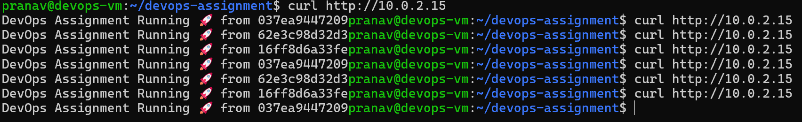
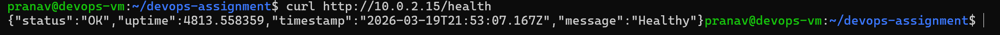
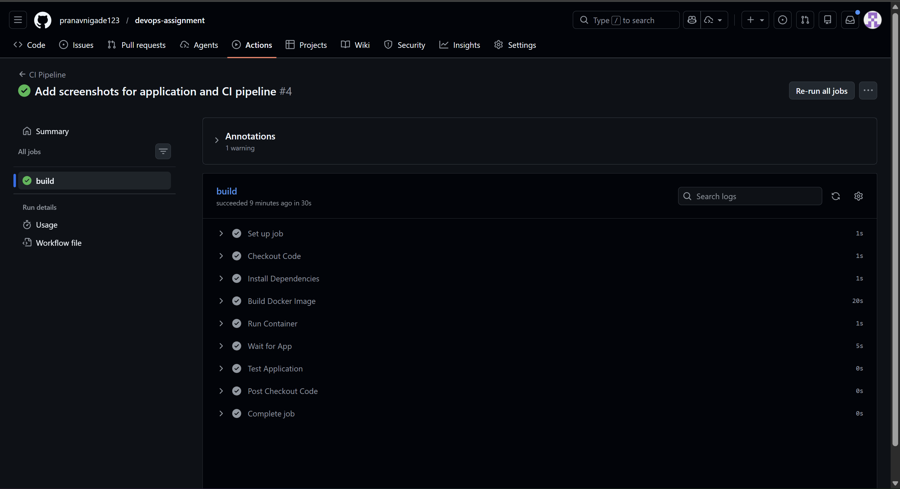

# DevOps Assignment – Node.js + Docker Compose + Nginx + CI/CD

---

# 🚀 Quick Start – Run the Application

### 1. Clone the repository

```bash
git clone https://github.com/pranavnigade123/devops-assignment.git
cd devops-assignment
```

---

### 2. Start the application using Docker Compose

```bash
docker-compose up -d --build
```

---

### 3. Access the application

```
http://VM-IP
```

---

### 4. Health check

```
http://VM-IP/health
```

---

# 📌 Project Overview

This project demonstrates a production-style DevOps setup where a Node.js application is:

* Containerized using Docker
* Managed using Docker Compose
* Exposed via Nginx reverse proxy
* Scaled to multiple instances
* Integrated with a CI pipeline using GitHub Actions

---

# 🛠️ Technologies Used

* Ubuntu Server (Virtual Machine)
* Node.js (Express)
* Docker
* Docker Compose
* Nginx (Reverse Proxy)
* Git & GitHub
* GitHub Actions (CI)

---

# 📁 Project Structure

```
devops-assignment
│
├── Dockerfile
├── docker-compose.yml
├── .env
├── .github/workflows
│   └── main.yml
├── nginx
│   └── default.conf
│
└── app
    ├── server.js
    ├── package.json
    └── package-lock.json
```

---

# ⚙️ Application Features

## ✅ Environment Variables

Application uses environment variables:

```
APP_MESSAGE=DevOps Assignment Running 🚀
PORT=3000
```

---

## ✅ Logging

All incoming requests are logged:

```bash
GET /
GET /health
```

Logs can be viewed using:

```bash
docker logs <container_id>
```

---

## ✅ Health Endpoint

```
/health
```

Response:

```json
{
  "status": "OK",
  "uptime": 123.45,
  "timestamp": "...",
  "message": "Healthy"
}
```

---

# 🐳 Docker Compose Setup

The system consists of two services:

### 🔹 App Service

* Node.js application
* Runs on port 3000 (internal only)

### 🔹 Nginx Service

* Runs on port 80
* Acts as reverse proxy

---

# 🌐 Nginx Reverse Proxy

Configuration:

```nginx
server {
    listen 80;

    location / {
        proxy_pass http://app:3000;
        add_header Cache-Control "public, max-age=60";
    }

    location /health {
        proxy_pass http://app:3000;
        add_header Cache-Control "no-cache";
    }
}
```

---

# 🔁 Scaling & Load Balancing

The application is scaled using:

```bash
docker-compose up -d --scale app=3
```

This creates multiple containers:

```
app_1
app_2
app_3
```

---

## 🔄 Load Balancing

* Nginx forwards requests to the service `app`
* Docker distributes requests across containers using round-robin

Example response:

```
DevOps Assignment Running 🚀 from <container_id>
```

---

# 🔄 CI Pipeline (GitHub Actions)

The pipeline triggers on:

```
push to main branch
```

### Steps performed:

1. Checkout code
2. Install dependencies
3. Build Docker image
4. Run container
5. Test application using curl

---

# 🌍 Application Access

### Main Application

```
http://VM-IP
```

---

### Health Endpoint

```
http://VM-IP/health
```

---

# 🔄 How a Request Flows Through the System

When a user accesses:

```
http://VM-IP
```

the request flows as follows:

---

### 🔹 Step 1 — Browser sends request

The browser sends an HTTP request to the Virtual Machine on **port 80**.

---

### 🔹 Step 2 — Nginx container receives the request

The request is received by the **Nginx container**, which is exposed on port 80.

Nginx acts as a **reverse proxy**, forwarding requests to the backend application.

---

### 🔹 Step 3 — Request forwarded to application service

Nginx forwards the request using:

```
proxy_pass http://app:3000;
```

Here, `app` is a Docker service name resolved through Docker’s internal network.

---

### 🔹 Step 4 — Docker performs load balancing

Docker distributes the request across multiple running containers:

```
app_1
app_2
app_3
```

This happens using round-robin load balancing.

---

### 🔹 Step 5 — Application processes request

The selected container processes the request:

* `/` → returns message
* `/health` → returns health status

---

### 🔹 Step 6 — Response sent back

Response flows back:

```
Node.js Container
↓
Docker Network
↓
Nginx Container
↓
Browser
```

---

# 🧠 Key Concepts Demonstrated

* Reverse proxy using Nginx
* Container networking in Docker
* Service discovery using Docker Compose
* Load balancing with multiple containers
* Environment-based configuration
* Logging and monitoring basics
* CI pipeline using GitHub Actions

# 📸 Screenshots

### 🔹 Docker Containers Running


---

### 🔹 Application Running (Home Page)



---

### 🔹 Health Endpoint



---

### 🔹 CI Pipeline Success (GitHub Actions)



---


# 👨‍💻 Author

Pranav Nigade
