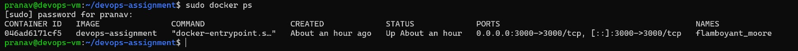
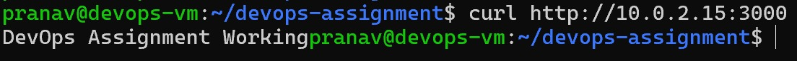
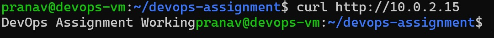
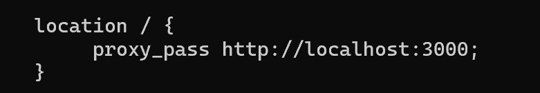

# DevOps Assignment – Node.js + Docker + Nginx

## Quick Start – How to Run the Application

1. Clone the repository

git clone https://github.com/pranavnigade123/devops-assignment.git
cd devops-assignment

2. Build the Docker image

docker build -t devops-assignment .

3. Run the Docker container

docker run -d -p 3000:3000 devops-assignment

4. Access the application

Direct container access:

http://VM-IP:3000

Through Nginx reverse proxy:

http://VM-IP

Expected output:

DevOps Assignment Working

---

# Project Overview

This project demonstrates a simple DevOps workflow where a Node.js application is containerized using Docker and served through Nginx as a reverse proxy.

The application returns the message **“DevOps Assignment Working”** when the root route `/` is accessed.

The entire environment runs inside an **Ubuntu Virtual Machine created using VirtualBox**.

---

# Technologies Used

* Ubuntu Server 24.04 (Virtual Machine)
* VirtualBox
* Node.js (Express)
* Docker
* Nginx
* Git
* GitHub

---

# Virtual Machine Setup

The assignment required the environment to be created inside a VirtualBox VM.

An Ubuntu Server VM was created and configured with Docker, Git, and Nginx.

While the VirtualBox terminal works, the screen size was small and difficult to read.
To improve usability and simulate a real server environment, the VM was accessed remotely using **SSH with port forwarding**.

Connection command used:

ssh pranav@localhost -p 2222

This approach reflects real DevOps practices where servers are usually managed remotely using SSH instead of a graphical interface.

---

# Project Structure

devops-assignment
│
├── Dockerfile
├── README.md
├── screenshots
│
└── app
  ├── server.js
  ├── package.json
  └── package-lock.json

---

# Node.js Application

A simple Express application was created.

File: `app/server.js`

The application listens on **port 3000** and returns:

DevOps Assignment Working

when the root route `/` is accessed.

---

# Docker Containerization

A Dockerfile was written to package the Node.js application with all required dependencies.

Steps performed by Docker:

1. Use the official Node.js base image
2. Copy application files
3. Install dependencies
4. Start the Node.js server

Docker image was built using:

docker build -t devops-assignment .

Container was started using:

docker run -d -p 3000:3000 devops-assignment

This creates the port mapping:

VM port 3000 → Docker container port 3000

So the application becomes accessible at:

http://VM-IP:3000

---

# Nginx Reverse Proxy Configuration

Nginx was configured to forward incoming HTTP requests to the Docker container.

Configuration file edited:

/etc/nginx/sites-available/default

Configuration used:

location / {
proxy_pass http://localhost:3000;
}

After updating the configuration, Nginx was restarted:

sudo systemctl restart nginx

Now the application can be accessed without specifying port 3000:

http://VM-IP

---

# VM IP Address

The VM IP was obtained using:

ip a

VM IP:

10.0.2.15

Application endpoints:

Direct Docker access:

http://10.0.2.15:3000

Through Nginx reverse proxy:

http://10.0.2.15

---

# How the Request Flows (Practical Explanation)

When a user opens the application in a browser, the request passes through several components.

Step 1 — Browser sends request

The user enters:

http://10.0.2.15

The browser sends an HTTP request to the VM on **port 80**.

---

Step 2 — Nginx receives the request

Nginx is running on the VM and listening on **port 80**.

Instead of serving a static webpage, Nginx checks its configuration and finds this rule:

proxy_pass http://localhost:3000;

This rule tells Nginx to forward the request to another service running on port 3000.

---

Step 3 — Request forwarded to Docker container

Nginx forwards the request to:

localhost:3000

Earlier when the container was started, the following mapping was created:

VM:3000 → Docker Container:3000

So requests reaching port 3000 on the VM are sent directly to the Docker container.

---

Step 4 — Node.js application processes request

Inside the container, the Node.js Express application is running.

It receives the request for the route `/` and returns the response:

DevOps Assignment Working

---

Step 5 — Response travels back to the browser

The response travels back through the same path:

Node.js App
↓
Docker Container
↓
Nginx Reverse Proxy
↓
Browser

The browser then displays the message:

DevOps Assignment Working

---

# Architecture Diagram

Browser
↓
Nginx (Port 80)
↓
Docker Container (Port 3000)
↓
Node.js Express Application

---

# Screenshots

### Docker container running

### Application running through Docker

### Application running through Nginx

### Nginx reverse proxy configuration

---

# Author

Pranav Nigade
